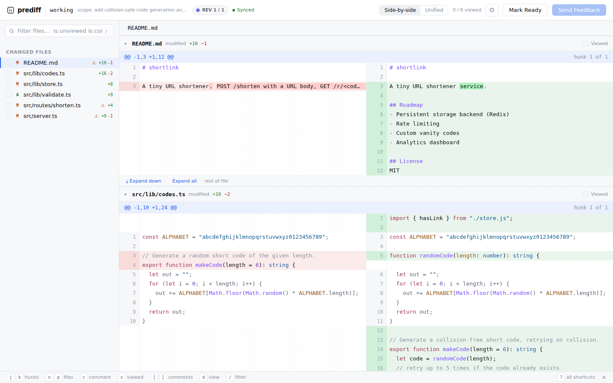
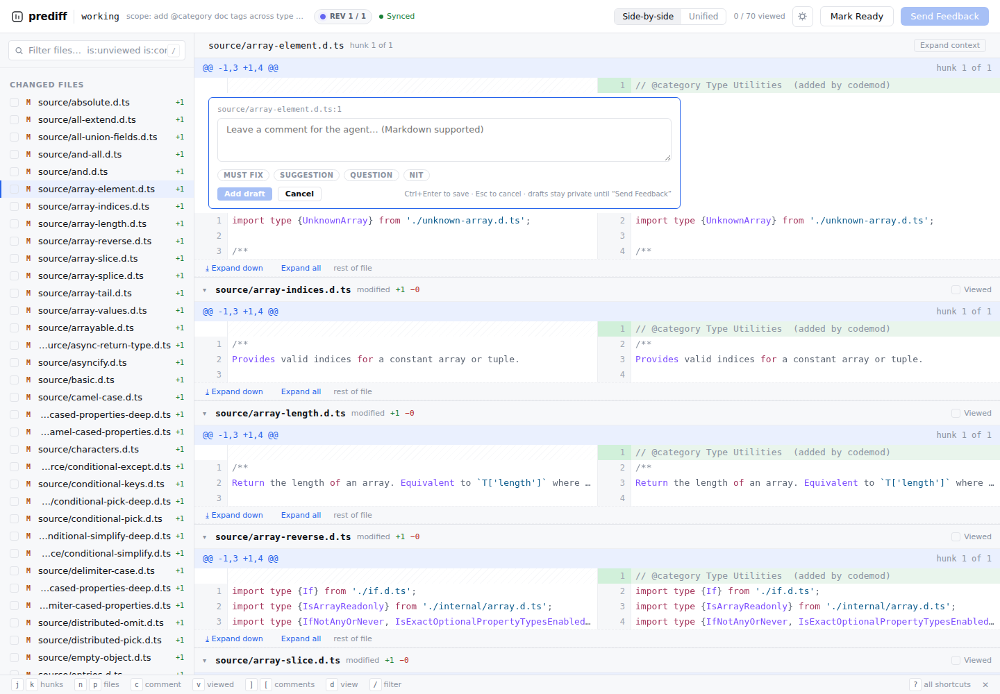
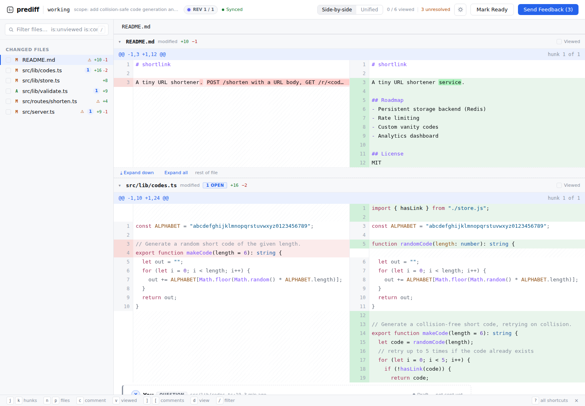
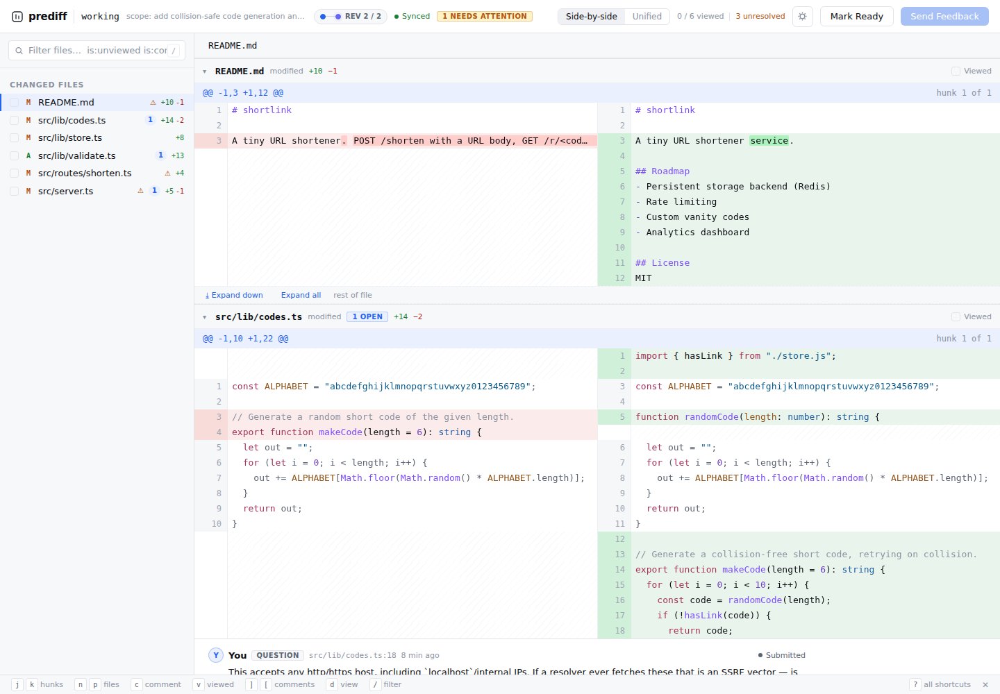
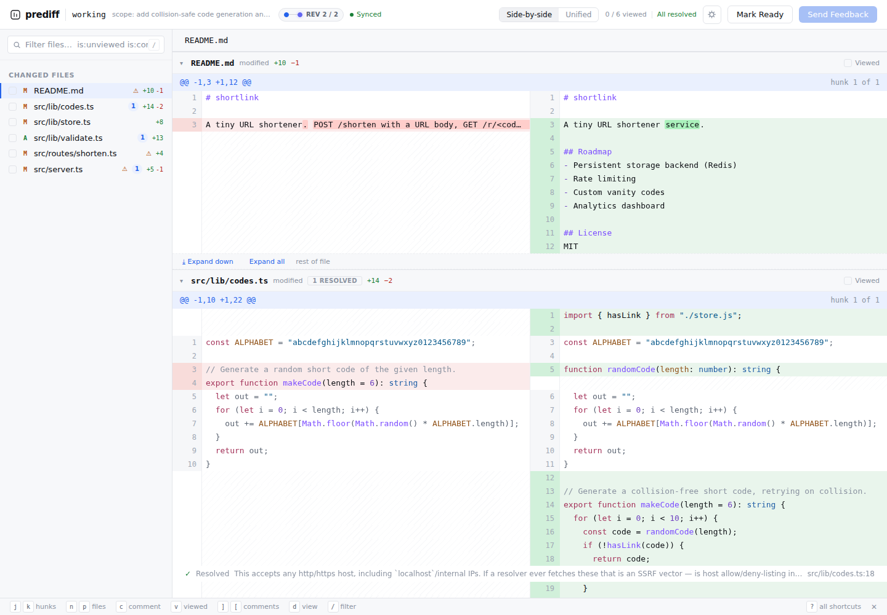
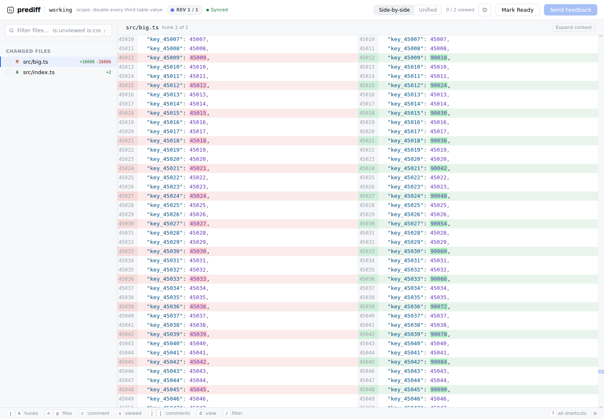

# prediff — Real-Use UX Gap Analysis

**Repository under test:** `https://github.com/alexdrydew/prediff`
**Commit:** `45dbb2a` ("build(ui): rebuild frontend bundle with QA F2/F3/F4 fixes"), cloned 2026-07-18.
**Framing:** whether prediff earns a place in an *agent-in-the-loop* local review workflow — not a feature-matrix pass/fail.

---

## Tester profile

I review code for a living: pull requests on GitHub daily and local diffs constantly, and I drive AI coding agents (Claude Code most days, plus Cursor and Copilot agent mode) as a routine part of building. My normal loop is "let the agent make a change, then review the change before it becomes a commit or a PR," which is exactly the workflow prediff targets — so my reference points below are GitHub PR review, Gerrit, Graphite, JetBrains/VS Code diff review, and `difit`, judged against what an agent-in-the-loop review actually needs.

## Environment & setup path

| Item | Value |
|---|---|
| OS | Ubuntu 24.04.4 LTS (Linux 6.18.5 kernel), headless x86-64 |
| Install method | **Bun / source** path from the current README. The Nix runtime path couldn't be exercised (my sandbox blocks egress to `nixos.org`), but I confirmed from `flake.nix` exactly what it installs — see §3/§4. |
| Toolchain | Bun 1.3.13, Node 22.22.2, git 2.43.0 |
| Browser | Chromium 141 (driven via Playwright 1.56, because the box is headless; a normal dev would point their own Chrome/Firefox at the daemon URL). Light and dark both render. |
| prediff state | `~/.local/share/prediff/<repo-id>/` |

Because the machine is headless, I ran the daemon and pointed a real Chromium instance at the per-repo URL rather than using an on-screen browser. That is the one respect in which my setup differs from a laptop dev; everything the daemon and CLI do is identical.

> **Command note:** on the Bun/source install the CLI is invoked as `bun src/cli/index.ts <cmd>` (there is no `prediff` binary on PATH — see §3, item 1). For readability I write it as `prediff <cmd>` throughout this report; that's the command as the agent skill file spells it, and what it *should* be after install.

## How I tested (real use, not a feature matrix)

I built a small but realistic TypeScript service (an in-memory URL shortener: `store`, `codes`, `validate`, two routes, a fake HTTP layer) and committed a baseline. Then I had an agent make a **nontrivial multi-file change** — collision-safe code generation, URL validation as a new module, a new `/stats` endpoint, plus one deliberately out-of-scope README rewrite — and I reviewed *that* the way I review agent output. I then played the agent side through the documented CLI loop and iterated to completion: **open → surface URL → comment in the browser → Send Feedback → `wait`/`comments` from the CLI → edit files to fix → `refresh` → `resolve` with replies → Mark Ready.** I ran several passes (initial review, a fix round that produced an orphaned comment and an addressed comment, a resolution round, and a daemon-restart check), plus a second throwaway repo to confirm one data-integrity question. This is what I actually hit in that use — not an exhaustive QA sweep, and I make no claim to have found every bug.

**Second round, at scale.** To pressure-test the findings that only matter on big changes, I ran a second block of sessions on a **real repo** (`sindresorhus/type-fest`, an agent-style codemod touching **70 files**) and on a **50,000-line file** with a ~33k-line diff. I exercised keyboard-first navigation, the file filter, large-file handling, and revision behavior, and I cross-checked several UI questions directly against the frontend component source (`ThreadRow.tsx`, `FileTree.tsx`, `MetaRow.tsx`) rather than inferring them. That second round corrected one of my own first-round findings (the developer *can* resolve/reply/reopen threads — see the headline below) and let me measure performance directly instead of reasoning about it. Where a finding below says "measured" or "at scale," it comes from this round.

> **Out of scope for this report (by instruction):** I did not audit `design/` for spec compliance, did not run scripted edge-case matrices, did not test multiple OSes/browsers, and recorded no video. The screenshots are included only where a picture explains a finding faster than prose.

**Screenshots (attached PNGs; embedded below and referenced from the findings):**

- `screenshot-1-diff-and-scope-flags.png` — the diff UI on first open, with the ⚠ scope flags (see §1.2).
- `screenshot-2-comments-send-feedback.png` — three tagged draft comments and the "Send Feedback (3)" state.
- `screenshot-3-orphan-needs-attention.png` — revision 2 with the "1 NEEDS ATTENTION" orphaned-comment badge and an "addressed" comment.
- `screenshot-4-all-resolved.png` — the "All resolved" end state with a collapsed resolved thread.
- `screenshot-5-70-file-flat-list.png` — the second-round 70-file codemod: the flat file list at scale (§1.6).
- `screenshot-6-50k-line-loaded.png` — the 50,000-line file after "Load anyway": virtualized rendering of a 66k-line diff (§2.5).

---

## 1. UX Gap Analysis

Severity uses only: `dealbreaker`, `significant friction`, `nice-to-have`.

Headline: **the core loop is genuinely good and it works.** Comments persist server-side the instant they exist, survive a daemon kill, and reach the agent as structured JSON with real code anchors. The gaps below are about the review *surface* around that loop, not the loop's integrity.

> **Correction from my second round (worth stating up front):** I initially suspected the developer couldn't close conversations themselves. That's wrong — `ThreadRow.tsx` confirms the developer gets a **Resolve** and a **Reply** button on every submitted/addressed comment, a **Reopen** button on resolved ones, and full orphan triage (re-anchor / convert to file note / dismiss). So thread-level control is properly the reviewer's. The only thing missing at that level is a repo-wide **Approve / Request changes** verdict distinct from **Mark Ready** — small enough that I've left it off the gap list rather than pad the count. Verifying this away is exactly what the second round was for.

### 1.1 No place to leave a review-level (non-line) comment — `significant friction`
- **Expected:** every mature review tool has a top-level review body — GitHub's "Leave a comment / Approve / Request changes" summary, Gerrit's patch-level message. It's where you say "overall this approach is wrong, restructure X before anything else."
- **When I missed it:** right after opening the review. My first instinct was to tell the agent "good direction, but the collision retry and the validation belong in one place" — a statement about the *change as a whole*, not any single line. There is nowhere to put it. Every comment requires clicking a gutter; the composer is always line-anchored.
- **Why it matters:** in agent-in-the-loop review, the highest-value feedback is often architectural ("you solved the wrong problem"), and it has no line to attach to. prediff's own `skills/prediff-review/SKILL.md` concedes this — it tells the agent that if the developer disagrees they may "raise it in chat." That means the tool's structured, persisted, never-lost feedback channel silently *doesn't cover* the most important category of feedback, pushing it to an unstructured side channel the agent's loop can't `wait` on.

### 1.2 Scope flagging is a blunt path-keyword heuristic and mislabels the most important file — `significant friction`
- **Expected:** if a tool advertises out-of-scope detection (a real differentiator here), I expect it to reflect what the change actually touches, or to stay quiet.
- **When I missed it:** scanning the file list on first load. I passed `--scope "add collision-safe code generation and URL validation"`. prediff flagged `src/routes/shorten.ts` with a ⚠ out-of-scope marker — but `shorten.ts` is *the* file that wires the requested validation into the request path (it's the most in-scope file in the change). Meanwhile the genuinely-unrelated README rewrite was correctly flagged. Hovering reveals the logic: *"Path shares no keywords with the stated scope … informational only."* It's matching scope words against **file paths**, so `codes.ts`/`validate.ts` pass on the words "code"/"validation" and `shorten.ts` fails.
- **Why it matters:** a scope signal I can't trust is worse than none — I stopped looking at the ⚠ column after the second false flag. The documented fix (`--scope-files "globs"`) pushes the burden onto the agent to declare its file set up front, which the agent often can't do accurately before it starts. (Screenshot 1 above: note the ⚠ on `src/routes/shorten.ts`.)

### 1.3 No content search / in-diff find — `significant friction`
- **Expected:** Ctrl-F across the diff, or an in-app find, in every other review tool and IDE.
- **When I missed it:** trying to jump to where `makeCode` was used after reading its definition. The only search box is a **file-name** filter (with nice `is:unviewed`/`is:commented` qualifiers) — there is no way to search diff *content*.
- **Why it matters:** this is a direct, and I think under-appreciated, cost of the (otherwise excellent) virtualized renderer, and I confirmed it at scale in round two. On the 70-file diff I planted a unique token deep in file #58 and checked: it is **not in the page DOM at load** (only the visible rows are), so the browser's own Ctrl-F can't find it either — and the page has exactly **one** text input, the file-name filter, which matches paths, not content. On a small diff it's fine; on the kind of sprawling multi-file change agents love to produce, "where is this symbol touched" becomes scrolling and hoping. The performance win quietly took away a capability every competing tool has.

### 1.4 No line-level interdiff between revisions — `significant friction`
- **Expected:** GitHub's "changes since your last review" and Gerrit's patch-set interdiff — after the author pushes fixes, show me *only the lines that moved*, not the whole diff again.
- **When I missed it:** re-reviewing after the agent ran `refresh` (revision 2). I wanted to see just the three spots it changed.
- **What prediff does give you (credit where due — I checked this in round two):** a **file-level** "agent touched this file since your last look" dot in the sidebar (`agentTouched` in `FileTree.tsx`), the **"addressed"** comment state that points you back to commented spots the agent changed, and a **Session history** panel to *view* any prior revision. What it does **not** have is a rev-N-vs-rev-N-1 line diff — I confirmed there's no interdiff view in the code.
- **Why it matters:** the file dot answers "which files did it touch," but on a large file the agent rewrote, you still re-scan the whole file to find the handful of changed lines. The agent loop is inherently iterative — review, fix, re-review — so that per-round re-scan is the most repeated cost in the loop and it grows with change size. The file-level signal softens it but doesn't remove it, which is why it stays `significant friction` rather than a dealbreaker.

### 1.5 The `suggestion` tag is only a label — no apply-a-concrete-change affordance — `nice-to-have`
- **Expected:** GitHub's suggested-change block: the reviewer writes the exact replacement and the author applies it verbatim in one click.
- **When I missed it:** on the `/stats` comment, where I knew the precise change I wanted. prediff has a `suggestion` *tag*, but it's just a category — the agent still hand-implements from my prose.
- **Why it matters:** agent-in-the-loop is the ideal place for this — a machine-appliable patch would let the agent apply my exact edit with zero interpretation drift. It's a real missed opportunity, but the agent can already act on prose, so it earns only the `nice-to-have` rating above.

### 1.6 Flat file list, no directory tree — `nice-to-have`
- **Expected:** a tree or at least directory grouping, like every IDE review pane and GitHub's file tree.
- **When I missed it:** in round two, navigating the 70-file codemod. Despite a component literally named `FileTree.tsx`, the sidebar renders a **flat list of full paths** with no nesting or collapsing by directory (I confirmed both in the running UI — 70 flat entries, no `tree`/`treeitem` roles — and in the component source). It does group **auto-collapsed** generated/large files into a separate section with a "mark all viewed" button, which is a nice touch, but that's not directory navigation.
- **Why it matters:** fine at six files; painful at sixty (I felt it directly at seventy). Agents routinely touch many files, so this scales the wrong way — it's navigation overhead rather than something that stops the review, which is why it sits at `nice-to-have`.

---

## 2. Bugs & jank actually encountered

Not an exhaustive hunt — just what I hit in real use. prediff was notably stable: no crashes, no console errors, and no failed network requests (other than Google Fonts, which the box can't reach and which degrades gracefully) across every session.

**2.1 Re-anchor can leave a comment `submitted` after its function was rewritten — surprising, low impact.**
- **Repro:** comment on a line whose exact text is common (e.g. `      return code;`). Have the agent substantially rewrite the surrounding function but keep that one line's text. Run `prediff refresh`.
- **Observed:** the comment re-anchored (19 → 18) and stayed **`submitted`**, not **`addressed`**, even though the whole function around it changed. A sibling comment whose anchored line text *did* change correctly flipped to `addressed`.
- **Environment:** as above; prediff `45dbb2a`.
- **Impact:** low but real — "addressed" is the signal the reviewer uses to know where to re-look, and it keys on the anchored line's text rather than the surrounding hunk, so a rewrite that preserves one line can slip through as if untouched. No data lost; just a misleading state.

**2.2 "Send Feedback" opens a confirmation modal, and the draft count stays until you confirm — janky first impression, not a bug.**
- **Repro:** create drafts, click the primary **Send Feedback (N)** button.
- **Observed:** it opens a "Send feedback to agent? This will submit N draft comments and signal the agent to start Revision 2" modal with *Send N comments / Send now / Cancel*. Until you confirm, the button still reads "Send Feedback (N)" and nothing is sent — for a second I thought my click hadn't registered and the agent's `wait` (correctly) timed out because I hadn't actually sent.
- **Impact:** cosmetic/expectation only. The confirmation itself is reasonable; the double "Send" labeling (button, then "Send N comments" / "Send now" in the modal) is momentarily confusing.

**2.3 A data-integrity scare I could NOT reproduce — reporting it as a non-bug for honesty.**
During fast scripted interaction I once saw a draft's text/tag appear to be overwritten by a later draft's — which, if real, would break the tool's headline "feedback is never lost" promise. I treated that as important enough to isolate: on a clean second repo I created two drafts slowly on two different files and read each back by ID from the daemon (`GET /api/comments/<id>`). **Both stored their own distinct text correctly — no overwrite.** The earlier anomaly was an artifact of my automation editing an already-open composer, not prediff. The draft store is sound. I'm including this because "I suspected a bug and verified it away" is part of honest real use, and because the persistence story otherwise held up perfectly (see 2.4 / verdict).

**2.4 Persistence held under the strongest test I gave it (positive).**
I killed the daemon mid-review (`prediff stop`) and reopened. All three comments **and** their agent replies survived on disk, at the correct revision. The "the daemon outlives the agent; nothing is lost" claim is real, and it's the best thing about the tool.

**2.5 Large files are silently withheld until you click "Load anyway" — momentary "did it break?", and a footnote on the perf claim.**
- **Repro:** open a review where one file has a big diff (I used a 50,000-line file with a ~33k-line change). Expand it.
- **Observed:** instead of the diff, you get a meta row reading **"large diff withheld for speed — [Load anyway]."** Files over **800 changed lines** also start auto-collapsed. The thresholds are real constants in the code (`LARGE_FILE_COLLAPSE_LINES = 800`, `LARGE_FILE_LINES = 5000`); above 5000 changed lines the hunks are withheld from the manifest entirely until you force-load.
- **Impact / fairness note:** this is a *reasonable* protective choice, not a bug — and it's honestly better than difit's "slow/janky on huge diffs" failure mode the README calls out. But it's undocumented and, the first time, reads as "the diff failed to load." It also puts an asterisk on the headline "flat performance… first diff line in ~160 ms whether the diff is 1k or 50k lines": that's the *engine's* capability, and I confirmed it holds — a forced render of the 66,667-line diff took **~147 ms server-side**, and once loaded the virtualization is genuinely excellent (DOM stayed bounded at ~50–65 rows while scrolling that 66k-line diff, deep content rendering on demand). The nuance is just that the *default* experience on a genuinely large file is "withheld, click to load," not "instant 50k."

**2.6 Keyboard-first navigation works well (positive, verified at scale).**
On the 70-file diff I drove review entirely from the keyboard: `n`/`p` jump between files, `j`/`k` between hunks, and `c` opens the comment composer on the focused line. All responded correctly. For agent-in-the-loop review — where you want to blast through a change quickly — this is a real strength and matches what the shortcut bar advertises.

---

## 3. First-run friction (against the current README)

The install itself was painless — `bun install`, then `bun src/cli/index.ts open working`, and I had a working review in the browser in under a minute. The friction was in the gaps between what the README says and what actually happens:

1. **The documented agent loop uses a `prediff` command the source install never creates.** The README "Usage" tells you to run `bun src/cli/index.ts open working`, but `skills/prediff-review/SKILL.md` — the file the *agent* follows — is written entirely as `prediff open …`, `prediff wait …`, `prediff resolve …`. There is no `prediff` on PATH after the Bun/source path; only Nix installs a binary. So the moment you hand the skill to a real agent, its commands fail verbatim. `package.json` does declare `"bin": {"prediff": …}`, so `bun link` would fix it — but the README never mentions linking. I had to invoke the full `bun …/src/cli/index.ts` path everywhere. **This is the single most jarring first-run gap**, because it breaks the very workflow the tool is built around.
2. **The `frontend/` directory implies a build step that you don't actually need — and the README never says so.** Seeing `frontend/` with its own `bun install` and `ui:build`, I assumed I had to build the UI before the daemon would serve it. In fact `public/` ships a prebuilt, self-consistent bundle and `open` serves it as-is. It works — but I only learned that by reading the server source. One README sentence ("the UI is prebuilt and committed; no build needed") would remove the doubt.
3. **`open` tries to launch a browser by default; on a headless/remote box you need `--no-browser`.** The README's agent-loop snippet doesn't mention it, and only `--help` reveals the flag (there's also an undocumented `PREDIFF_NO_BROWSER` env var). On my headless box it degraded gracefully — it printed the URL and exited 0 — but a lot of agent work happens over SSH on remote dev boxes, and nothing in the README prepares you for that.
4. **The example ports are fiction.** README and SKILL show `http://localhost:4966` / `:4870`; my daemon came up on `:39281` (and `:45823`, `:44509` in later sessions). It's a per-repo port and you're expected to read the `url` field — but every documented example shows a port you'll never see, which briefly makes you think something's misconfigured.
5. **Nothing warns you that large files are collapsed/withheld.** The first time a big agent-generated file shows "large diff withheld for speed" instead of a diff (see §2.5), it reads like a failure. A one-line note about the 800/5000-line thresholds and the "Load anyway" affordance would turn a "did it break?" into an "ah, on purpose."

None of these blocked me, but each cost a "wait, is this broken?" moment, and #1 will bite every agent that follows the skill file literally.

---

## 4. Blunt verdict

**Would I adopt prediff over my current workflow for reviewing an AI agent's local changes? Not yet as my default — but it's the first tool in this space I'd actually keep installed, and I expect to adopt it once one thing is fixed.**

Against my alternatives:
- **vs plain `git diff` / `difit`:** prediff is clearly better *for this job*. `git diff` and difit have no persisted, agent-readable comment channel and no notion of a review that survives the agent's process. prediff's persisted five-state comments + the `wait`/`comments`/`resolve` loop are exactly what agent-in-the-loop review wants, and difit's two failure modes (lost feedback, slow huge diffs) are genuinely fixed here.
- **vs IDE diff/review (VS Code, JetBrains):** prediff wins on the *loop* (the agent can read my comments as structured data and act on them; my IDE can't hand the agent anything), but loses on *review surface* — my IDE has find, go-to-symbol, a file tree, and inline everything.
- **vs GitHub PR after push:** GitHub still wins on review *ergonomics* (review summary, request-changes, resolvable conversations, suggestions, search) — but prediff's entire premise is to catch problems *before* anything reaches GitHub, and for that pre-push checkpoint it's better positioned than "push a PR and review there," which pollutes history with review-fix commits.

So the loop is right and the persistence is trustworthy; what holds it back from default status is (a) the review surface is thinner than mature tools (no review-level comment, no content search, no line-level interdiff) and (b) the very first agent-loop attempt breaks because the documented `prediff` command doesn't exist after a source install. (To be clear after my second round: thread-level control — resolve, reply, reopen — *is* the reviewer's, so that's not among the gaps.)

**The single change that would most increase adoption:** ship a real, installable `prediff` binary on the common path — `npm i -g prediff` / `brew install prediff` (or, minimally, a README line telling you to `bun link`) so the command matches the agent skill and the documented loop runs verbatim on the first try. The interesting part: the Nix path *already does exactly this* — `flake.nix` wraps a real `prediff` binary onto PATH (`mainProgram = "prediff"`) — so the fix is bringing that same one-command experience to the install path most people actually use. Right now the tool's strongest asset (the CLI agent loop) is gated behind a first-run mismatch that fails exactly when a new user hands the skill to their agent. Fix that, and the thing that makes prediff special starts working the moment someone installs it.

*(Close runner-up, if "install" is considered already solved via Nix: add a review-level comment box — §1.1 — so the most valuable feedback in agent review has a home inside the loop instead of in chat.)*
